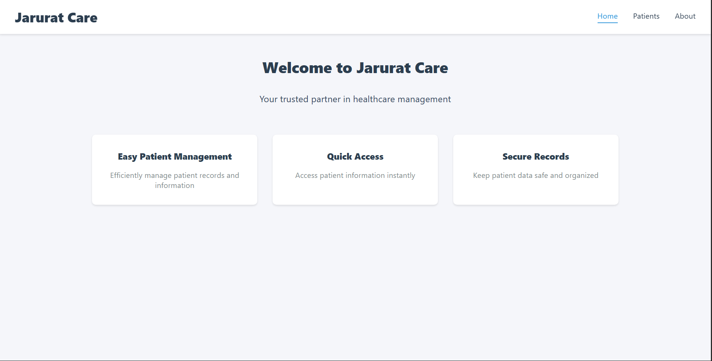
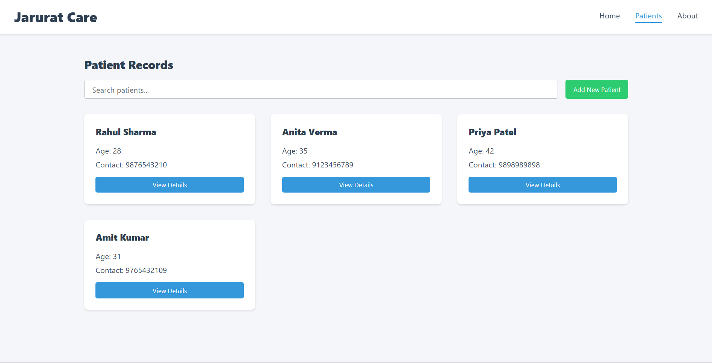
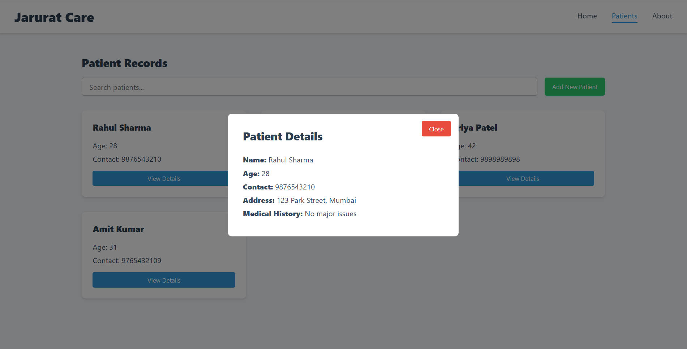
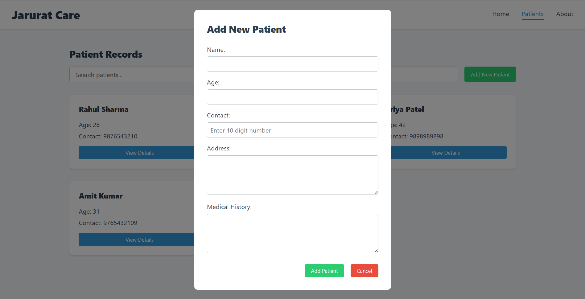

# Patient Records Dashboard

A modern, responsive patient records management system built with React.js. This application helps healthcare professionals manage patient information efficiently with features like search, filtering, and real-time updates.

## 🌟 Features

- **Modern UI/UX**: Clean and professional interface built with React
- **Responsive Design**: Works seamlessly on desktop and mobile devices
- **Patient Management**:
  - View patient list in a grid layout
  - Search patients by name
  - View detailed patient information
  - Add new patients with validation
- **Real-time Search**: Instantly filter patients as you type
- **Form Validation**:
  - Contact number must be exactly 10 digits
  - Age must be a positive number
- **Active Navigation**: Visual indicators for current page

## 🚀 Live Demo

[Demo Link](Add your demo link here) <!-- Replace with your deployed app link -->

## 📸 Screenshots

### Home Page


_Landing page with feature highlights_

### Patients List


_Grid view of patient cards with search functionality_

### Patient Details


_Detailed view of patient information_

### Add New Patient


_Form for adding new patients with validation_

## 🛠️ Technologies Used

- React.js
- React Router v6
- CSS3 (Pure CSS, no frameworks)
- Vite (Build tool)

## ⚙️ Installation

1. Clone the repository:
   ```bash
   git clone https://github.com/yourusername/patient-records.git
   ```

2. Navigate to the project directory:
   ```bash
   cd patient-records
   ```

3. Install dependencies:
   ```bash
   npm install
   ```

4. Start the development server:
   ```bash
   npm run dev
   ```

5. Open your browser and visit:
   ```
   http://localhost:5173
   ```

## 🔧 Configuration

No additional configuration is required. The application uses mock data by default, which can be found in \`src/data/mockPatients.js\`.

## 📁 Project Structure

```
patient-records/
├── src/
│ ├── components/ # Reusable UI components
│ ├── pages/ # Page components
│ ├── data/ # Mock data
│ ├── styles/ # CSS files
│ ├── App.jsx # Main component
│ └── main.jsx # Entry point
├── public/ # Static assets
└── package.json # Project dependencies
```

## 🌿 Branches

- \`main\` - Production ready code
- \`development\` - Latest development changes

## 🤝 Contributing

1. Fork the repository
2. Create your feature branch (\`git checkout -b feature/AmazingFeature\`)
3. Commit your changes (\`git commit -m 'Add some AmazingFeature'\`)
4. Push to the branch (\`git push origin feature/AmazingFeature\`)
5. Open a Pull Request

## 📝 License

This project currently does not include a license.

## 🙋‍♂️ Support

For support, rm7718166418@gmail.com or create an issue in this repository.

---

### Future Enhancements

- [ ] Backend integration
- [ ] Authentication system
- [ ] Patient appointment scheduling
- [ ] Medical history timeline
- [ ] Export patient records to PDF
- [ ] Dark mode support

---

Made with ❤️ by Rahul Maity
